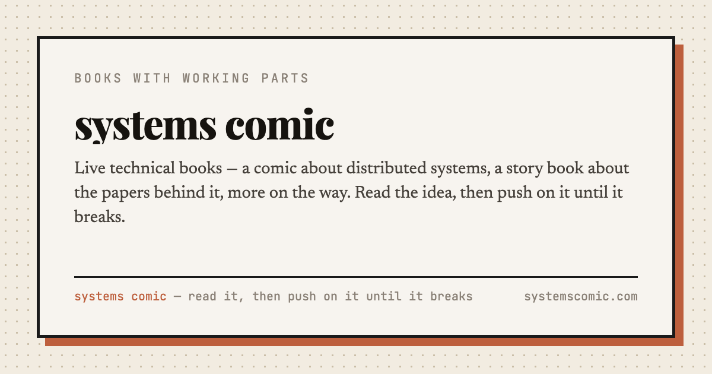

# systems comic

**I asked AI to write tech commics.**

**[Read them →](https://systemscomic.com)**



## What's on the shelf

| | | |
|---|---|---|
| **[DDIA, as a live comic](https://systemscomic.com/ddia)** | complete, growing | Replication, partitioning, consensus — twelve short comics, each built around one misconception it exists to kill. Then met again inside Kafka, Postgres, Redis, RabbitMQ, the web tier and S3, in nine-chapter deep-dives with animated traces and a hardware envelope you can overload. Plus two whole applications you push until they break. |
| **[The Papers That Broke the Database](https://systemscomic.com/papers)** | being written | The history of distributed systems through the papers that made it. One chapter live of eighteen; the season's map is on the page. |
| **[The calculator](https://systemscomic.com/calculator)** | shared instrument | Put in a workload, get machine counts back — and check every number against the division that produced it. |

## Quick start

```bash
npm install
npm run dev            # http://localhost:5173
npm run build          # typecheck + build + per-route HTML
npm test               # the suite
npm run check:diagrams # geometry lint (needs the dev server + Chrome)
npm run og             # re-render social cards after editing scripts/routes.mjs
```

## Credits & disclaimer

Book one is an unofficial companion to ***Designing Data-Intensive Applications*, 1st edition, by
Martin Kleppmann** — chapter numbers follow that edition, since the 2nd renumbers. **Unofficial and
not affiliated** with the author or O'Reilly. Read the book; this is a lens on it, not a
replacement. Primary sources are linked at the point of use throughout.

Every limit here is an order-of-magnitude rule of thumb, useful for intuition. Verify against your
own load tests before committing production capacity.

## License

Code is MIT (see [LICENSE](LICENSE)).

The written and illustrated content — comics, prose, diagrams and runbooks — is © Samuel Xing, all
rights reserved. Quote it with attribution; please ask before republishing wholesale.

---

If this was useful, a ⭐ is the whole compensation plan.
