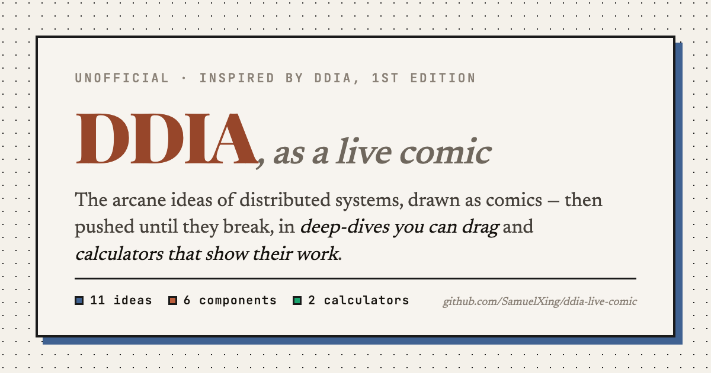

# DDIA, as a live comic

**[Read it →](https://systemscomic.com)**

An unofficial, illustrated companion to *Designing Data-Intensive Applications* (1st edition).
The arcane ideas of distributed systems, drawn as comics — then pushed until they break, in
deep-dives you can drag and calculators that show their work.



## The idea

Most systems writing sits at one of two extremes: a diagram with no numbers, or a benchmark with
no argument. This site is built on the belief that the interesting part is in between, and that it
goes in one direction:

> **Idea → Component → Architecture**

You meet an idea as a comic. You then watch a real component embody it, down to the fsync. Then
you size it, with arithmetic you can check.

### Three layers

| | | |
|---|---|---|
| **[Read the Ideas](https://systemscomic.com/read)** | 11 chapters | The concept lens. Tail latency, storage engines, replication, partitioning, transactions, consensus, the shuffle, stream–table duality — each a six-panel comic with a misconception it exists to kill, and where it shows up in the wild. |
| **[Deep-Dives](https://systemscomic.com/components)** | 6 components | Kafka, Postgres, Redis, RabbitMQ, the web tier, S3 — each a nine-chapter treatment: the core abstraction, animated request traces, a hardware envelope you can overload, the scaling ladder, a 3am runbook, and the primary sources. |
| **[Calculators](https://systemscomic.com/calculator)** | 2 tools | Capacity (what a workload forces you to build) and latency budget (where the milliseconds go). Both are pure arithmetic — no model, no guessing. |

## What makes it different

**Every number shows its work.** Click a figure in a calculator verdict and it flashes the row it
came from. The reasoning is generated from the same arithmetic that produced the answer, so it
cannot drift from it.

**It is a calculation, not an opinion.** No language model decides which database you should use.
The capacity calculator ranks storage options on closed-form arithmetic over four decomposed
dimensions — data model, storage engine, distribution, atomicity scope — and shows you the
sensitivity, not just the estimate. Pin a non-optimal choice and it re-derives what that costs you.

**Constants are labelled MEASURED or ASSUMED**, and derived rather than asserted where possible —
fibre's 200 km/ms is `c ÷ n` with the refractive index shown, rounded down on purpose.

**Published figures only.** Chapter 7 of every deep-dive uses real operator numbers with a link:
Notion's 480 logical shards, Stack Overflow's day of counters, S3's 2013→2025 growth. Ratios are
arithmetic on those figures, and daily averages are labelled as such.

**Sliders snap to a 1-2-5 ladder.** A continuous slider invites "557k/s", which reads as a
measurement when it is a shrug. Derived numbers round to two significant figures for the same
reason.

## Quick start

```bash
npm install
npm run dev          # http://localhost:5173
```

```bash
npm run build        # typecheck + production build into dist/
npm run preview      # serve the production build
npm run typecheck    # TypeScript only
npm test             # vitest
npm run check:diagrams   # SVG geometry lint — needs the dev server running
```

## Project layout

```
src/
├── main.tsx, App.tsx        # router shell; every route is a lazy chunk
├── site.ts                  # repo + canonical URLs, in one place
├── styles/                  # design tokens + per-page scoped stylesheets
├── components/              # shared chrome: nav, footer, TracePlayer, MetricRunbook
├── read/                    # the concept lens
│   ├── comics/              # one file per idea — panels, bubbles, sources, think-prompt
│   └── diagrams.tsx         # hand-authored SVG figures
├── deepdives/
│   ├── calcModel.ts         # capacity arithmetic (pure, tested)
│   ├── latencyModel.ts      # latency arithmetic (pure, tested)
│   ├── ladder.tsx           # the shared 1-2-5 input ladders
│   ├── ModulePanel.tsx      # the Sandbox widget every ch.5 renders
│   └── <component>/         # Page.tsx · traces.ts · ops.ts · scaleout.ts · HardwareEnvelope.tsx
└── sims/                    # experimental whole-app simulations
```

Each deep-dive keeps its maths in plain exported functions (`computeScaleOut(values)`) and its
diagrams in plain data (`TraceSpec`), so nothing has to be rendered to be reused.

## How it stays honest

The interesting failures here are silent ones — a label that clips, a route drawn through a box, a
slider that says one number while its thumb sits on another. So they are tested rather than
eyeballed:

- **`inputs.test.ts`** — every slider default sits on its own ladder, and every ladder climbs.
  (It exists because a default that is off-ladder renders the thumb on the nearest rung while the
  label prints the stored value: the panel contradicts itself before you touch it.)
- **`sandboxes.test.ts`** — every sandbox swept to both ends of every ladder and both corners; no
  rendered string may say `NaN` or `Infinity`.
- **`reach.test.ts`** — every calculator recommendation must be reachable *and* avoidable. A card
  that always fires is not advice.
- **`calcModel.reality.test.ts`** — sanity anchors against known systems, plus a sensitivity sweep.
- **trace lint** — runs in dev and warns on any particle route that cuts through a node.
- **`npm run check:diagrams`** — renders every comic in headless Chrome and measures real
  `getBBox()` values for out-of-frame text, overlaps, and labels struck through by a line.

All limits are order-of-magnitude engineering rules of thumb, useful for building intuition.
Verify against your own load tests before committing production capacity.

## Credits & disclaimer

Built as an illustrated companion to ***Designing Data-Intensive Applications*, 1st edition, by
Martin Kleppmann** — chapter numbers follow that edition, since the 2nd renumbers. This project is
**unofficial and not affiliated** with the author or O'Reilly. Read the book; this is a lens on it,
not a replacement for it.

Primary sources are linked at the point of use throughout, and every deep-dive ends with five
worth an evening.

## License

Code is MIT (see [LICENSE](LICENSE)).

The written and illustrated content — the comics, prose, diagrams and runbooks — is
© Samuel Xing, all rights reserved. Quote it with attribution; please ask before republishing it
wholesale.

---

If this was useful, a ⭐ is the whole compensation plan.
